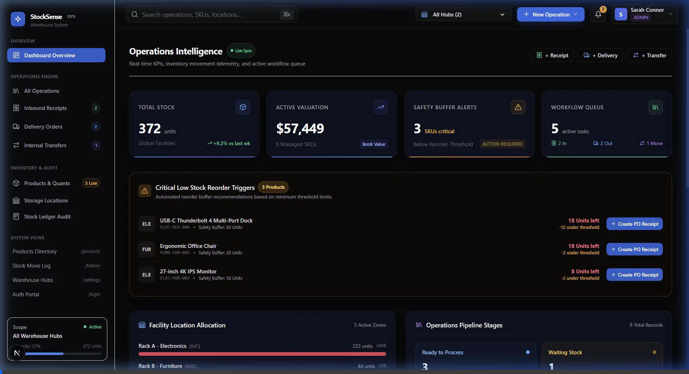
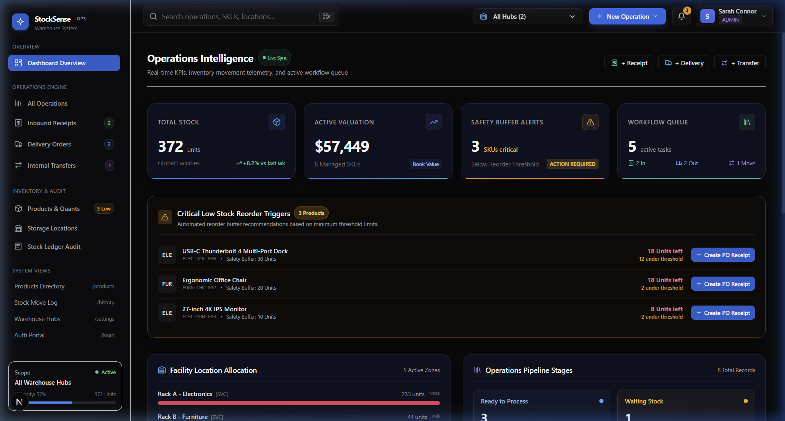

# 🎬 StockSense — Demo Presentation & Script Guide

Welcome to the **StockSense Hackathon Presentation Guide**. This document outlines the core functional flow, architecture highlights, recorded UI video walkthrough, and a 90-second script for project video submissions or live judge presentations.

---

## 📽️ Recorded UI & Functional Walkthrough Video

Below is the live interaction walkthrough animation showing the clean UI, smooth navigation, KPI panels, and operations telemetry:



---

## 📸 Core UI Screenshot



---

## 🗣️ 90-Second Demo Presentation Script

```text
[0:00 - 0:15] INTRODUCTION & PROBLEM
"Hello everyone! This is StockSense — a next-generation Enterprise Warehouse Operations OS engineered for real-time inventory precision, automated reorder triggers, and multi-hub tracking."

[0:15 - 0:35] DASHBOARD INTELLIGENCE & TELEMETRY
"At first glance, our Operations Intelligence dashboard delivers instant real-time telemetry: Total Stock count across global facilities, Live Valuation tracking, Safety Buffer Alerts, and active workflow pipelines."

[0:35 - 0:55] AUTOMATED SAFETY BUFFERS & LOW-STOCK TRIGGERS
"Notice the Critical Low Stock Reorder Triggers. StockSense monitors inventory threshold limits and enables warehouse managers to trigger Purchase Order Receipts in a single click."

[0:55 - 1:15] WAREHOUSE HUB ALLOCATION & WORKFLOW QUEUE
"We also track real-time spatial allocation — showing exact storage rack capacity (such as Rack A at 100% capacity) alongside pipeline stages like Ready to Process, Waiting Stock, and In Transit."

[1:15 - 1:30] CLOSING & TECH STACK
"Built with Next.js 16, TypeScript, Tailwind CSS, and Prisma backend architecture, StockSense ensures seamless scaling and zero-latency operational control. Thank you!"
```

---

## 🛠️ Key Technical Features & Value Proposition

| Feature | Technical Implementation | Value Proposition |
| :--- | :--- | :--- |
| **Real-time Telemetry** | Active tracking of stock units across managed SKUs | Eliminates manual inventory audit delays |
| **Automated PO Triggers** | Safety buffer threshold monitoring | Prevents stockouts & delivery bottlenecks |
| **Spatial Rack Analytics** | Capacity tracking (Rack level metrics) | Optimizes physical warehouse space utilization |
| **Multi-Role RBAC System** | User role switcher (Admin / Inventory Mgr / Worker) | Enforces enterprise operational security |

---

## 🚀 Architecture Highlights

- **Framework**: Next.js 16 (App Router) + TypeScript
- **Styling**: Tailwind CSS v4 with custom dark mode glassmorphism UI
- **Database & ORM**: PostgreSQL / SQLite with Prisma ORM
- **State & Telemetry**: Dynamic live sync operations engine
